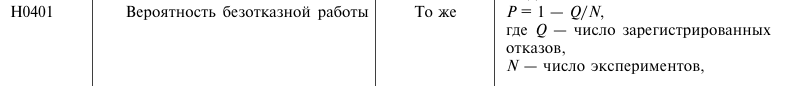
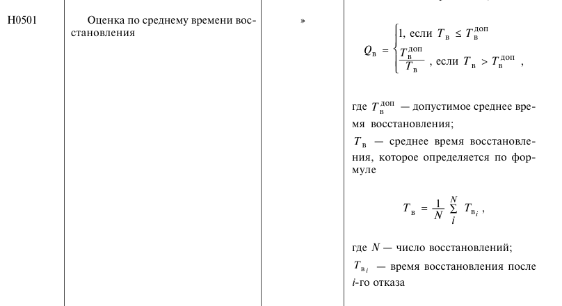
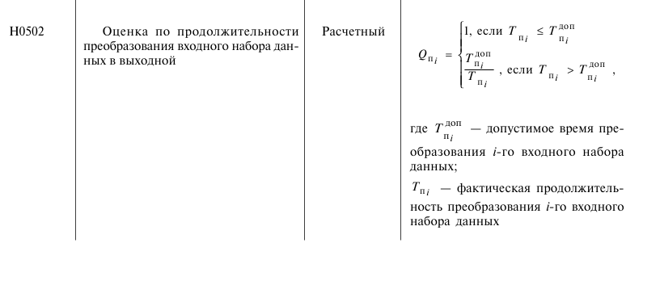
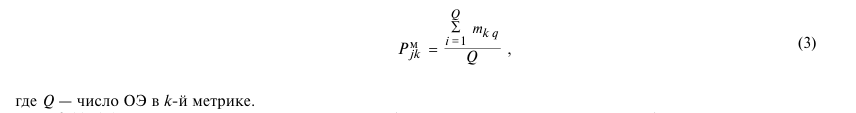
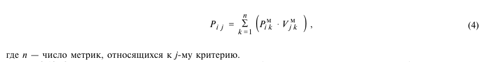
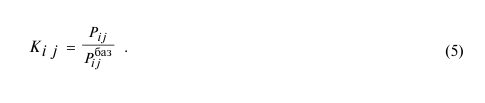

# Лабораторная работа 5

# Вариант 3
Исходные данные  
Число зарегистрированных отказов Q = 7  
Число экспериментов N = 1300  
Cреднее время восстановления Тв подчиняется равномерному распределению в интервале (оценить по выборке из 100 значений), с [0,6;0,1]  
Допустимое время восстановления Тдоп,с = 0,65  
Фактическая продолжительность преобразования i-го входного  набора данных подчиняется равномерному закону распределения в интервале (оценить по выборке из 200 значений), с [10;16]  
Допустимое время преобразования i-го входного набора данных Тдоп,с = 10  
Базовые критерии надежности выбрать равными 0,9  

Выбор оценочных элементов  
Метрика 1 Н0101-Н0110 - 10 элементов  
Метрика 2 Н0201-Н0205 - 5 элементов  
Метрика 3 Н0301-Н0305 - 5 элементов  
Метрика 4 Н0401 - 1 элемент  
Метрика 5 Н0501-Н0502 - 2 элемента

Расчет оценочных элементов  
Берем формулы из таблицы 5:
- Для Н01,Н02,Н03 нет данных, поэтому можно взять либо 0 либо 1.  
- Формула Н0401 (Вероятность безотказной работы)  

- Формула Н0501 (Оценка по среднему времени восстановления)  

- Формула Н0502 (Оценка по продолжительности преобразования входного набора данных в выходной)

Расчет метрик по формуле 3  

Расчет абсолютных метрик по формуле 4  

Расчет относительных показателей по формуле 5  
  

Расчет фактора надежности по формуле 6  

